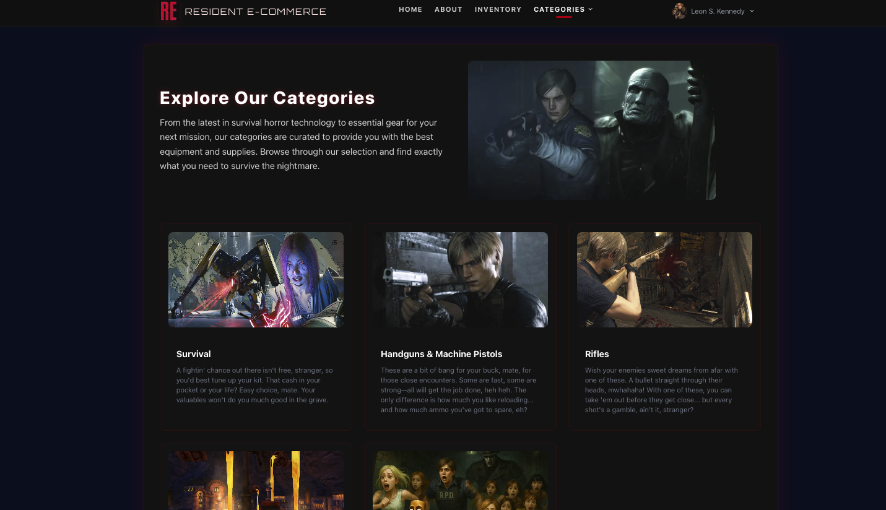
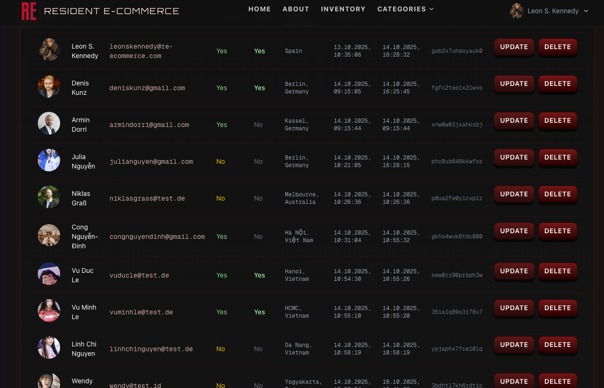
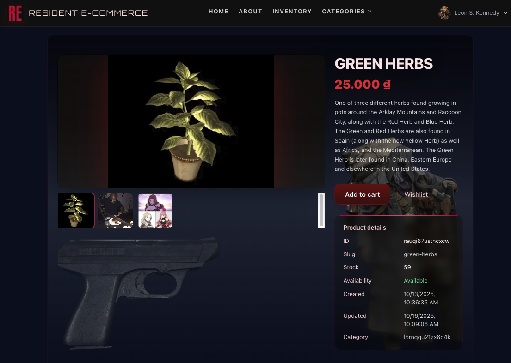

# re-ecommerce

Lightweight example e‑commerce app using PocketBase for the backend and Next.js for the frontend.

## About The Project

"What're ya buyin'?"

RE-E-commerce is a fan-made e-commerce application inspired by the world of Resident Evil. Imagine a place where you can browse and purchase iconic items from the game series, from powerful weapons to life-saving herbs. This application is a demonstration of a modern web application built with a Next.js frontend and a PocketBase backend.

### Screenshots

Here's a glimpse into the application.





This repository contains:

- `backend/` — PocketBase binary, migrations and the sqlite data directory (`pb_data/`).
- `frontend/` — Next.js (App Router) frontend built with React, TypeScript and Tailwind.

## Features

### 🛒 E-Commerce Functionality

- **Product Catalog**: Browse products with categories
- **Search Bar**: Easily find products by name or description
- **Filtering**: Refine product listings by various criteria using a filter dropdown
- **Shopping Cart**: Add to cart, update quantities, and manage items with Redux state management
- **Wishlist**: Save favorite items for later
- **Checkout**: Secure payment processing via Stripe with automatic order creation
- **Order Tracking**: View order history with detailed information (items, shipping address, status)
- **Inventory Management**: Real-time stock tracking with automatic decrement on purchase

### 💳 Payment Integration

- **Stripe Integration**: Full Stripe Checkout implementation
- **Webhook Sync**: Automatic synchronization between Stripe and PocketBase
  - Product creation/updates sync from Stripe to database
  - Price updates sync automatically
  - Order creation on successful checkout
  - Automatic image downloads from Stripe product images
- **Currency Support**: VND (Vietnamese Dong) with proper formatting
- **Customer Management**: Automatic customer record creation and linking to user accounts

### 👤 User Features

- **Authentication**: Secure user registration and login with PocketBase auth
- **User Profiles**: Manage personal information and view order history
- **Guest Checkout**: Support for guest purchases (optional)
- **Session Management**: Persistent login sessions with token-based auth

### 🎛️ Admin Dashboard

- **Product Management**: Create, update, and delete products with image uploads
- **Category Management**: Organize products into categories
- **Order Management**: View all orders, update status (pending, shipped, cancelled, in process, finish)
- **User Management**: View and manage registered users
- **Inventory Control**: Track stock levels and manage product availability

### 🎨 User Interface

- **Responsive Design**: Mobile-first design that works on all devices
- **Dark Theme**: Resident Evil-inspired dark theme with red accents
- **Real-time Updates**: Live cart updates and inventory status
- **Toast Notifications**: User-friendly feedback for all actions
- **Loading States**: Smooth loading indicators for better UX
- **Empty States**: Helpful messages when no data is available
- **Legal Pages**: Dedicated pages for About Us, Privacy Policy, and Terms of Service

### 🔧 Technical Features

- **TypeScript**: Full type safety across the application
- **Server-Side Rendering**: Next.js App Router with SSR capabilities
- **API Routes**: Custom Next.js API routes for backend integration
- **State Management**: Redux Toolkit for global state
- **Form Validation**: Client and server-side validation
- **Error Handling**: Comprehensive error handling and user feedback
- **Database Migrations**: Version-controlled database schema changes
- **File Storage**: PocketBase native file storage for product images
- **Cookie Consent**: GDPR-compliant cookie management

### 📦 Collections & Schema

- **Users**: Authentication and profile data
- **Products**: Product catalog with images, pricing, stock, and metadata
- **Categories**: Product categorization
- **Orders**: Order history with items, shipping, and status
- **Customer**: Stripe customer ID mapping to users

## Quick overview

- The PocketBase backend serves the REST API and files (images) and includes the admin console.
- The Next.js frontend consumes the PocketBase REST API. The frontend reads the PocketBase URL from `NEXT_PUBLIC_POCKETBASE_URL` (defaults to `http://127.0.0.1:8090`).

## Prerequisites

- Node.js (recommended 18+)
- npm or yarn
- A macOS / Linux / Windows terminal to run the included PocketBase binary (or Docker)

## Run the backend (PocketBase)

There is a prebuilt PocketBase binary in `backend/`. The app data files live under `backend/pb_data/` (includes `data.db`, `auxiliary.db` and `storage/`).

Run PocketBase from the `backend` folder:

```bash
cd backend
# make sure the binary is executable
chmod +x ./pocketbase

# start the server (serves on port 8090 by default)
./pocketbase serve --dir pb_data --http 127.0.0.1:8090
```

After the server starts you can open the admin console at:

http://127.0.0.1:8090/_/

Notes:

- If you already have a PocketBase instance running on a different port, either stop it or change the `--http` address above.
- The `pb_migrations/` folder contains JS migration files used to create/update collections. If you modify migrations, run them via the PocketBase console or include them in your deployment pipeline.

Optional: Run PocketBase in Docker (example):

```bash
docker run --rm -p 8090:8090 -v $(pwd)/pb_data:/pb_data ghcr.io/pocketbase/pocketbase:latest serve --dir /pb_data --http 0.0.0.0:8090
```

## Run the frontend (Next.js)

The frontend expects the PocketBase REST endpoint to be available.

1. Open a terminal and start the frontend:

```bash
cd frontend
npm install
npm run dev
```

2. Open the app at:

http://localhost:3000

Build for production:

```bash
cd frontend
npm run build
npm run start
```

## Environment Variables

### Frontend Environment Variables

The frontend requires environment variables to connect to PocketBase and configure features. Create a `.env.local` file in the `frontend/` directory with the following variables:

```bash
# PocketBase API URL (required)
NEXT_PUBLIC_POCKETBASE_URL=http://127.0.0.1:8090

# Admin credentials for PocketBase (optional, used for admin operations)
PB_ADMIN_EMAIL=your-admin@example.com
PB_ADMIN_PASSWORD=your-admin-password

# Feature flags (optional)
NEXT_PUBLIC_ENABLE_ADD_TO_CART=true
```

**Frontend Variables Explained:**

| Variable                         | Required | Description                              | Default                 |
| -------------------------------- | -------- | ---------------------------------------- | ----------------------- |
| `NEXT_PUBLIC_POCKETBASE_URL`     | Yes      | PocketBase backend URL                   | `http://127.0.0.1:8090` |
| `PB_ADMIN_EMAIL`                 | No       | Admin email for backend operations       | -                       |
| `PB_ADMIN_PASSWORD`              | No       | Admin password for backend operations    | -                       |
| `NEXT_PUBLIC_ENABLE_ADD_TO_CART` | No       | Enable/disable add to cart functionality | `false`                 |

**Setup Instructions:**

1. Create the environment file:

   ```bash
   cd frontend
   cp .env.example .env.local  # if .env.example exists, or create manually
   ```

2. Edit `.env.local` with your values:

   ```bash
   NEXT_PUBLIC_POCKETBASE_URL=http://127.0.0.1:8090
   NEXT_PUBLIC_ENABLE_ADD_TO_CART=true
   ```

3. For production deployment (Vercel, etc.), set these variables in your hosting platform's environment configuration.

### Backend Environment Variables

The backend (PocketBase with hooks) requires environment variables for Stripe integration and other features. Set these as system environment variables or in your deployment configuration:

```bash
# Stripe Integration (required for payments)
STRIPE_API_KEY=sk_test_your_stripe_secret_key
STRIPE_WEBHOOK_SECRET=whsec_your_webhook_secret

# Frontend URL (required for production redirects)
FRONTEND_URL=https://your-production-domain.com

# Environment (optional)
NODE_ENV=production
```

**Backend Variables Explained:**

| Variable                | Required | Description                                              |
| ----------------------- | -------- | -------------------------------------------------------- |
| `STRIPE_API_KEY`        | Yes\*    | Stripe secret key (starts with `sk_test_` or `sk_live_`) |
| `STRIPE_WEBHOOK_SECRET` | Yes\*    | Stripe webhook signing secret (starts with `whsec_`)     |
| `FRONTEND_URL`          | Yes\*\*  | Your frontend production URL for checkout redirects      |
| `NODE_ENV`              | No       | Environment mode (`development` or `production`)         |

\* Required only if using Stripe checkout functionality  
\*\* Required for production deployment

**Setup Instructions:**

1. **For Local Development:**

   Set environment variables before starting PocketBase:

   ```bash
   cd backend
   export STRIPE_API_KEY=sk_test_your_key
   export STRIPE_WEBHOOK_SECRET=whsec_your_secret
   export FRONTEND_URL=http://localhost:3000
   ./pocketbase serve --dir pb_data --http 127.0.0.1:8090
   ```

   Or create a startup script (`start.sh`):

   ```bash
   #!/bin/bash
   export STRIPE_API_KEY=sk_test_your_key
   export STRIPE_WEBHOOK_SECRET=whsec_your_secret
   export FRONTEND_URL=http://localhost:3000
   export NODE_ENV=development
   ./pocketbase serve --dir pb_data --http 127.0.0.1:8090
   ```

2. **For Production Deployment:**

   Set environment variables in your hosting platform (Railway, Fly.io, Docker, etc.):

   ```bash
   STRIPE_API_KEY=sk_live_your_production_key
   STRIPE_WEBHOOK_SECRET=whsec_your_production_secret
   FRONTEND_URL=https://your-domain.com
   NODE_ENV=production
   ```

3. **Getting Stripe Keys:**

   - API Key: Get from [Stripe Dashboard](https://dashboard.stripe.com/apikeys)
   - Webhook Secret: Create webhook endpoint at [Stripe Webhooks](https://dashboard.stripe.com/webhooks)
     - Add endpoint URL: `https://your-backend-url/webhook`
     - Select events: `product.created`, `product.updated`, `price.created`, `price.updated`, `checkout.session.completed`
     - Copy the webhook signing secret

## Data and storage

- Database files: `backend/pb_data/data.db` and `backend/pb_data/auxiliary.db`.
- Uploaded files and thumbnails are stored under `backend/pb_data/storage/`.

If you want to seed or reset the database, replace `pb_data` with your own directory or modify the files directly (make backups first).

## Deployment

### Docker + Caddy (Production)

1. **Create `.env` file:**

   ```env
   NEXT_PUBLIC_POCKETBASE_URL=https://api.yourdomain.com
   FRONTEND_URL=https://yourdomain.com
   PB_ADMIN_EMAIL=admin@yourdomain.com
   PB_ADMIN_PASSWORD=your-secure-password
   NEXT_PUBLIC_ENABLE_ADD_TO_CART=true
   isProduction=production
   ```

2. **Deploy:**

   ```bash
   docker-compose up --build -d
   ```

3. **View logs:**

   ```bash
   docker-compose logs -f
   ```

4. **Update after changes:**
   ```bash
   docker-compose down && docker-compose up --build -d
   ```

See [DEPLOYMENT.md](./DEPLOYMENT.md) for full VPS deployment guide.

### Important Notes for Docker Deployment

- `NEXT_PUBLIC_POCKETBASE_URL` must be the **public URL** accessible from browsers
- Always **rebuild** after changing environment variables
- Clear browser cache after deployment

## Developer notes

- API helpers for the frontend: `frontend/src/lib/pocketbase.ts` contains convenience functions for categories, products and auth.
- The backend includes migration scripts under `backend/pb_migrations/`.
- The frontend uses Next.js 15 and React 19. The dev script uses Turbopack (`next dev --turbopack`).

## Troubleshooting

- PocketBase won't start: ensure the binary is executable (`chmod +x backend/pocketbase`) and that no other process uses port 8090.
- Images/avatars not visible: confirm files exist under `backend/pb_data/storage` and that PocketBase is running (files are served from `/api/files/...`).
- Frontend can't reach PocketBase: verify `NEXT_PUBLIC_POCKETBASE_URL` in `.env.local` and open that URL in the browser to confirm the admin UI loads.

## Contributing

If you'd like to contribute, please open issues or PRs on this repository. Keep migrations idempotent and include tests for new backend behavior when applicable.

## License

See `backend/LICENSE.md` for the PocketBase license. Repository-level license information can be added here if desired.

---

If you'd like, I can also add a small script in the root to start both backend and frontend concurrently (e.g. using npm-run-all) or a dev Makefile — tell me which you prefer and I'll add it.
